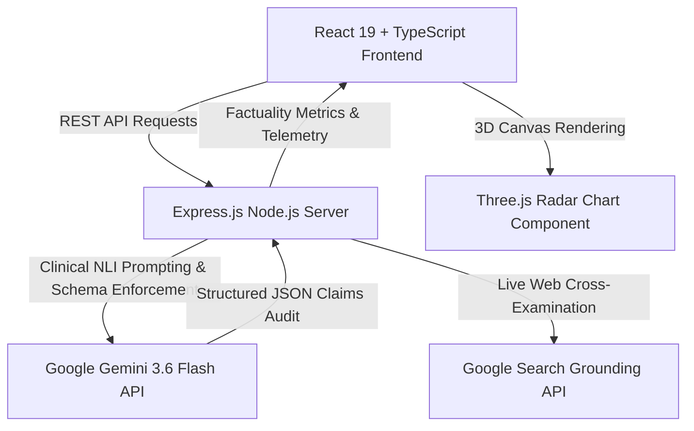

# 🛡️ Veritas Intelligence Engine — Hallucination Detector

[](https://react.dev)
[](https://www.typescriptlang.org/)
[](https://ai.google.dev/)
[](https://expressjs.com/)
[](https://vitejs.dev/)
[](https://threejs.org/)

> **Clinical Natural Language Inference (NLI) & Real-Time Hallucination Audit Platform for Large Language Model Outputs.**

Veritas Engine is an enterprise-grade forensic tool designed to audit, cross-examine, and benchmark LLM response factuality against source ground-truth documentation and live web references.

---

## 🌟 Key Features

### 🎯 Atomic Claim Deconstruction & Factuality Audit
- **Provisional Claim Decomposition**: Deconstructs complex LLM outputs into discrete atomic factual claims (3 to 6 statements).
- **Supported vs. Unsupported Detection**: Evaluates each claim against ground-truth source documents to detect subtle hallucinations, extrapolations, or outright contradictions.
- **Citation & Evidence Gap Analysis**: Highlights precise textual citations for verified claims, and pinpoints exact evidence gaps with proposed factual corrections for unsupported claims.

### 🔍 Grounded Web Search Verification
- **Google Search Grounding Integration**: Cross-examines disputed claims against real-time, live web search results.
- **Authoritative Citation Mapping**: Pulls verified external references and source links to confirm theoretical vs. factual statements.

### 📊 3D Interactive Radar & Telemetry Dashboard
- **Three.js Visualizations**: Interactive 3D radar chart rendering claim distribution, confidence levels, and model safety parameters.
- **Real-Time Telemetry Metrics**: Live measurement of analysis latency (ms), token processing speed (tokens/sec), forensic depth level, and overall hallucination percentage rate.

### ⚖️ Multi-Model Performance Variance Comparison
- **Cross-Model Benchmarking**: Compare factuality scores, hallucination rates, and latency across multiple LLM configurations side-by-side.

### 📜 Audit Timeline & History Logging
- **Session History Persistence**: Track historical audits across sessions with interactive claim filters and breakdown view.

---

## 🛠️ Architecture & Tech Stack



| Layer | Technology |
| :--- | :--- |
| **Frontend Framework** | React 19, TypeScript, Lucide React Icons |
| **Styling & UI** | TailwindCSS v4, Dark Glassmorphism Design |
| **3D & Animation** | Three.js (3D Radar Chart), Motion |
| **Backend Server** | Express.js, TypeScript (`tsx` runner) |
| **AI & Verification Engine** | `@google/genai` (Gemini 3.6 Flash model with JSON Schema enforcement) |
| **Build & Tooling** | Vite 6, ESBuild |

---

## 📁 Directory Structure

```
hallucination-detector/
├── server.ts                    # Express API server & Gemini SDK integration
├── index.html                   # HTML Entry point
├── metadata.json                # Project metadata & capabilities
├── package.json                 # Dependencies & scripts
├── tsconfig.json                # TypeScript configuration
├── vite.config.ts               # Vite build configuration
├── src/
│   ├── main.tsx                 # React DOM mount point
│   ├── App.tsx                  # Core layout & main shell
│   ├── index.css                # Global styles & design system tokens
│   ├── types.ts                 # TypeScript type definitions & interfaces
│   ├── components/
│   │   ├── AuditView.tsx        # Main claim audit workspace & document input
│   │   ├── CompareView.tsx      # Multi-model benchmarking comparison view
│   │   ├── TimelineView.tsx     # Historical audit log & activity view
│   │   ├── SettingsView.tsx     # Forensic level & engine configuration
│   │   ├── ThreeRadarChart.tsx  # Interactive 3D Three.js radar visualization
│   │   ├── HallucinationPopover.tsx # Grounding web search popover component
│   │   ├── TopAppBar.tsx        # Header & status bar
│   │   ├── NavigationDrawer.tsx # Sidebar navigation menu
│   │   └── HowItWorksModal.tsx  # Architecture documentation modal
│   └── data/
│       └── sampleDocuments.ts   # Pre-loaded benchmark source documents
```

---

## ⚡ Quick Start Guide

### Prerequisites
- **Node.js**: v18.x or higher
- **npm** or **bun**

### 1. Clone the Repository
```bash
git clone https://github.com/Reshma-reddy-ailuri/hallucination-detector.git
cd hallucination-detector
```

### 2. Install Dependencies
```bash
npm install
```

### 3. Environment Setup
Create a `.env.local` file in the root directory (or copy `.env.example`):
```bash
cp .env.example .env.local
```

Add your Google Gemini API key:
```env
GEMINI_API_KEY="your_actual_gemini_api_key_here"
```
> *Note: If no API key is supplied, the engine operates with high-precision simulated fallback audit data for demonstration purposes.*

### 4. Run Development Server
```bash
npm run dev
```
Open your browser and navigate to:
👉 **`http://localhost:3000`**

---

## 📡 API Endpoints

### `GET /api/health`
Checks server status and verification engine health.
```json
{
  "status": "ok",
  "engine": "Veritas NLI 4.2 Core"
}
```

### `POST /api/analyze`
Submits source text and a question for NLI claim extraction and factuality analysis.
- **Request Body**:
  ```json
  {
    "sourceDocument": "Official source text...",
    "question": "Target question to audit...",
    "forensicLevel": 5
  }
  ```

### `POST /api/grounding-search`
Performs real-time web search grounding for disputed or unsupported claims.
- **Request Body**:
  ```json
  {
    "claimText": "Commercial quantum processors operate at room temperature."
  }
  ```

---

## 👨‍💻 Developer & Contact

Developed by **Ailuri Reshma Reddy**  
- **GitHub**: [@Reshma-reddy-ailuri](https://github.com/Reshma-reddy-ailuri)  
- **Project Repository**: [https://github.com/Reshma-reddy-ailuri/hallucination-detector](https://github.com/Reshma-reddy-ailuri/hallucination-detector)

---

⭐ *If you find this project impressive, please consider giving it a star on GitHub!*
