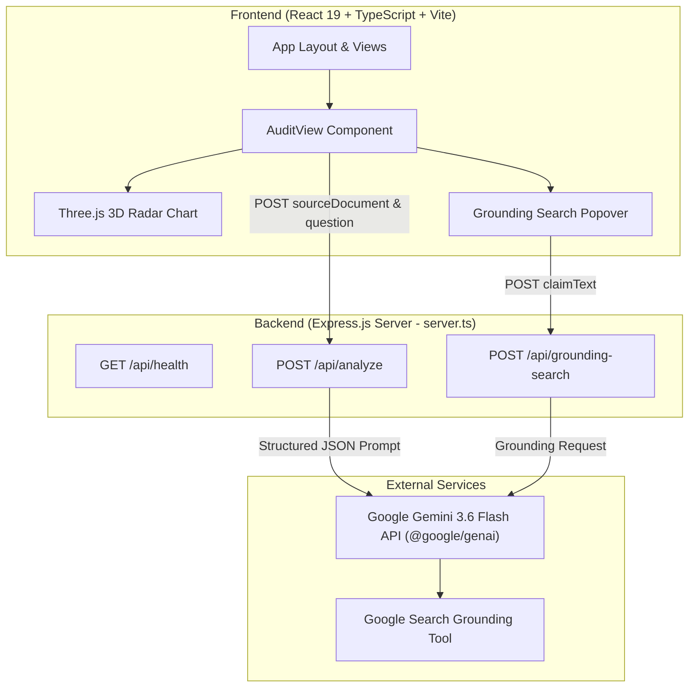

# Veritas Hallucination Detector

A web application that detects unsupported or hallucinated claims in LLM-generated responses by comparing them against user-provided source documents using structured Gemini LLM verification.

---

## Problem Statement

- **LLM Hallucinations**: Large Language Models frequently generate plausible-sounding statements that lack factual support from provided source contexts or contain factual inaccuracies.
- **Verification Need**: In document analysis, research, and technical workflows, relying on unverified LLM output poses risks of misinformed decision-making.
- **Solution**: This application decomposes an AI-generated answer into discrete factual claims and evaluates each claim against the source document using structured JSON output from Gemini, highlighting supported claims with citations and unsupported claims with evidence gap explanations.

---

## Features

- **Source Document Analysis**: Input custom text documents or select pre-loaded sample documents (such as corporate filings, quantum computing papers, or climate reports).
- **Question Answering & Synthesis**: Generates a targeted response to a question based on the provided document.
- **Atomic Claim Extraction**: Deconstructs the generated response into 3 to 6 discrete, factual propositions.
- **Claim Verification**: Evaluates each claim as either `supported` or `unsupported` relative to the source document.
- **Evidence Gap & Correction Details**: For unsupported claims, provides an explanation of missing or contradicting evidence along with a proposed ground-truth correction.
- **Citation Display**: For supported claims, displays verbatim citation quotes extracted from the source document.
- **Grounded Web Search**: Cross-examines specific claims against live Google Search results using Gemini's Google Search grounding feature.
- **Summary Metrics & Telemetry**: Displays overall hallucination rate percentage, claim counts (total, supported, unsupported), request latency (ms), and estimated token throughput.
- **3D Visualization**: Renders an interactive 3D radar chart using Three.js to display evaluation metrics (Factuality, Grounding, Precision, Transparency, Safety).
- **Audit Timeline & Model Comparison**: Maintains in-memory session history of audit runs and provides a UI view to compare model parameter configurations.
- **Structured JSON Schema**: Enforces schema-validated outputs from the Gemini API (`@google/genai`) to guarantee reliable parsing.

---

## System Workflow

```
[User Document + Question]
         │
         ▼
[Express Backend (/api/analyze)]
         │
         ▼
[Gemini 3.6 Flash API Call]
  - Prompt: Synthesize answer & deconstruct into atomic claims
  - Response Schema: JSON (synthesis, claims array with status & citations)
         │
         ▼
[Claim Classification & Metrics Calculation]
  - Filter supported vs. unsupported claims
  - Calculate hallucination rate (%) & latency telemetry
         │
         ▼
[React 19 Frontend Display]
  - Render synthesis text & claim breakdown cards
  - Render Three.js 3D metrics radar chart
  - Trigger optional Grounded Web Search (/api/grounding-search)
```

1. **Document & Question Submission**: The user submits a source document and a specific question via the React interface.
2. **Backend Processing**: The Express server forwards the prompt to `gemini-3.6-flash` configured with a strict JSON response schema.
3. **Synthesis & Claim Deconstruction**: Gemini generates an answer and splits it into discrete atomic claims.
4. **Verification & Citation Mapping**: Gemini evaluates each claim against the source text, returning status (`supported` / `unsupported`), citations for supported claims, and evidence gap explanations for unsupported claims.
5. **UI Rendering**: The frontend displays the synthesized response, color-coded claim breakdown cards, hallucination rate gauges, 3D radar visualization, and optional live web grounding search.

---

## Architecture



---

## Technology Stack

### Frontend
- **React 19**: User interface framework.
- **TypeScript 5.8**: Type safety across components and data types.
- **TailwindCSS 4**: UI styling and dark theme glassmorphism design.
- **Three.js**: 3D WebGL radar chart rendering.
- **Lucide React**: UI icons.
- **Motion**: Component transitions.

### Backend
- **Express 4.21**: Node.js web server.
- **`@google/genai` (v2.4.0)**: Official Google GenAI SDK for Gemini 3.6 Flash.
- **`dotenv`**: Environment variable management.
- **`tsx`**: TypeScript execution for Node.js.

### Build & Tooling
- **Vite 6.2**: Frontend development server and bundling.
- **ESBuild**: Server bundling for production.

---

## Folder Structure

```
hallucination-detector/
├── server.ts                    # Express API server & Gemini SDK integration
├── index.html                   # HTML entry point
├── metadata.json                # Project metadata
├── package.json                 # Node dependencies and scripts
├── tsconfig.json                # TypeScript compiler configuration
├── vite.config.ts               # Vite build configuration
├── src/
│   ├── main.tsx                 # React application entry point
│   ├── App.tsx                  # Main shell layout and tab state management
│   ├── index.css                # Global styles and Tailwind configuration
│   ├── types.ts                 # TypeScript interfaces for API & UI state
│   ├── components/
│   │   ├── AuditView.tsx        # Main audit workspace (document input & results)
│   │   ├── CompareView.tsx      # Model benchmarking UI view
│   │   ├── TimelineView.tsx     # Session audit history list
│   │   ├── SettingsView.tsx     # Forensic level & configuration controls
│   │   ├── ThreeRadarChart.tsx  # Three.js 3D WebGL radar chart component
│   │   ├── HallucinationPopover.tsx # Web grounding search popover component
│   │   ├── TopAppBar.tsx        # Top navigation header
│   │   ├── NavigationDrawer.tsx # Sidebar menu
│   │   └── HowItWorksModal.tsx  # Workflow explanation modal
│   └── data/
│       └── sampleDocuments.ts   # Pre-configured sample documents for testing
```

---

## API Endpoints

### `GET /api/health`
Returns system status and engine version string.
- **Response**:
  ```json
  {
    "status": "ok",
    "engine": "Veritas NLI 4.2 Core"
  }
  ```

### `POST /api/analyze`
Deconstructs and verifies an LLM answer against a source document.
- **Request Body**:
  ```json
  {
    "sourceDocument": "Full source text...",
    "question": "User question...",
    "forensicLevel": 5
  }
  ```
- **Response Body**:
  ```json
  {
    "synthesis": "Generated answer string",
    "claims": [
      {
        "id": "claim-1",
        "text": "Claim statement text",
        "status": "supported",
        "confidence": 95,
        "citation": "Verbatim quote from source"
      },
      {
        "id": "claim-2",
        "text": "Unsupported claim statement",
        "status": "unsupported",
        "confidence": 15,
        "evidenceGap": "Explanation of missing source evidence",
        "correction": "Corrected factual statement"
      }
    ],
    "stats": {
      "totalClaims": 2,
      "supportedCount": 1,
      "unsupportedCount": 1,
      "hallucinationRate": 50
    },
    "telemetry": {
      "latencyMs": 145,
      "tokensPerSec": 1240,
      "forensicLevel": 5
    }
  }
  ```
> *Note: If `GEMINI_API_KEY` is unconfigured, this endpoint returns deterministic mock audit data for demonstration purposes.*

### `POST /api/grounding-search`
Cross-examines a claim against live Google Search results.
- **Request Body**:
  ```json
  {
    "claimText": "Claim text to search..."
  }
  ```
- **Response Body**:
  ```json
  {
    "summary": "Grounded search summary text",
    "sources": [
      { "title": "Source Title", "uri": "https://example.com/article" }
    ]
  }
  ```

---

## Screenshots

*(Include project screenshots here)*

- **Main Audit Dashboard**: ``
- **Claim Breakdown & Citations**: ``
- **3D Metrics Radar Chart**: ``

---

## Installation & Setup

### Prerequisites
- **Node.js**: v18.x or higher
- **npm** (included with Node.js)

### Steps

1. **Clone the repository**:
   ```bash
   git clone https://github.com/Reshma-reddy-ailuri/hallucination-detector.git
   cd hallucination-detector
   ```

2. **Install dependencies**:
   ```bash
   npm install
   ```

3. **Configure Environment Variables**:
   Create a `.env.local` file in the root directory:
   ```env
   GEMINI_API_KEY="your_gemini_api_key_here"
   ```
   *(If omitted, the server operates using mock response data).*

4. **Start the development server**:
   ```bash
   npm run dev
   ```

5. **Access the application**:
   Open [http://localhost:3000](http://localhost:3000) in your web browser.

---

## Limitations

- **LLM-Based Verification**: Claim extraction and status classification rely on Gemini's structured output generation rather than a separate, dedicated Natural Language Inference (NLI) model.
- **No Standalone NLI Model**: The project does not currently integrate dedicated NLI architectures (such as RoBERTa-MNLI or DeBERTa-v3).
- **In-Memory State**: Audit history is maintained in React component state and is reset when the page reloads.
- **Context Size Limit**: Processing large documents is constrained by standard LLM context window limits and API payload size (`10mb`).

---

## Future Improvements

The following capabilities are planned for future iterations:
- **Dedicated NLI Model Integration**: Incorporating local or hosted NLI models (e.g., DeBERTa-v3-large-MNLI) to perform cross-encoder entailment checks independently of the primary LLM.
- **Vector Embeddings & RAG**: Implementing document chunking, embeddings, and vector similarity search (e.g., FAISS or local vector DB) for large document handling.
- **Document Parsing**: Adding support for PDF, DOCX, and OCR file uploads.
- **Persistent Database**: Adding PostgreSQL or SQLite database storage for audit history persistence.
- **Inline Highlight Rendering**: Directly highlighting supporting citations or contradicting text within the original document UI view.
