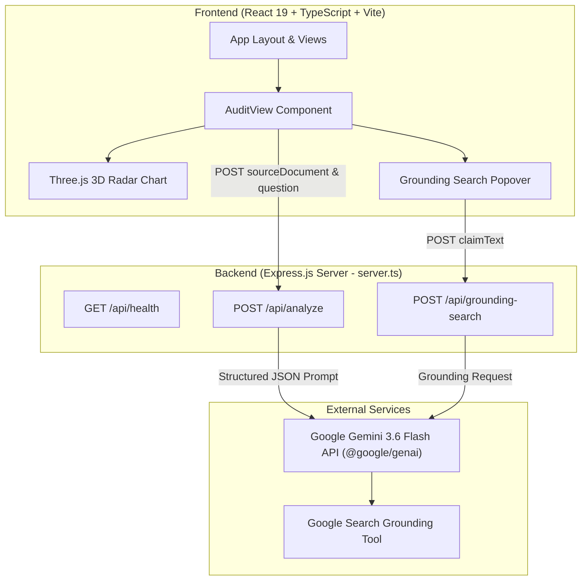

# Veritas – LLM Hallucination Verification Engine

Veritas is an AI-powered verification platform that improves the transparency of Large Language Model (LLM) responses by decomposing generated answers into atomic factual claims and verifying each claim against a user-provided source document using structured Gemini-based reasoning. The application highlights supported and unsupported claims, provides evidence references, confidence scores, and summary verification metrics.

---

## Problem Statement

- **LLM Hallucinations**: Large Language Models frequently generate plausible-sounding statements that lack factual support from provided source contexts or contain factual inaccuracies.
- **Verification Need**: In document analysis, research, and technical workflows, relying on unverified LLM output poses risks of misinformed decision-making.
- **Solution**: This application decomposes an AI-generated answer into discrete factual claims and evaluates each claim against the source document using structured JSON output from Gemini, highlighting supported claims with evidence excerpts and unsupported claims with evidence gap explanations.

---

## Features

- **Source Document Analysis**: Input custom text documents or select pre-loaded sample documents (such as corporate filings, quantum computing papers, or climate reports).
- **Question Answering & Synthesis**: Generates a targeted response to a question based on the provided document.
- **Atomic Claim Extraction**: Deconstructs the generated response into 3 to 6 discrete, factual propositions.
- **Claim Verification**: Evaluates each claim as either `supported` or `unsupported` relative to the source document.
- **Evidence Gap & Correction Details**: For unsupported claims, provides an explanation of missing or contradicting evidence along with a proposed factual correction.
- **Citation Display**: For supported claims, displays supporting citations and evidence excerpts from the source document.
- **Grounded Web Search**: Uses Gemini's Google Search grounding capability to retrieve additional supporting information from trusted web sources for selected claims.
- **Summary Verification Metrics**: Displays overall hallucination rate percentage, claim counts (total, supported, unsupported), request latency (ms), and estimated token throughput.
- **3D Dashboard Visualization**: Renders an interactive 3D radar chart using Three.js to display verification metrics (Factuality, Grounding, Precision, Transparency, Safety).
- **Audit Timeline & Verification Comparison**: Maintains in-memory session history of audit runs and provides a UI view for verification comparison across parameters.
- **Structured JSON Schema**: Enforces schema-validated outputs from the Gemini API (`@google/genai`) to guarantee reliable parsing.

---

## System Workflow

```
User uploads source document
↓
User asks question
↓
Gemini generates answer
↓
Gemini decomposes answer into atomic factual claims
↓
Gemini verifies each claim against the source document
↓
Frontend displays supported/unsupported claims with evidence, confidence scores, and summary metrics
```

1. **Document & Question Submission**: The user submits a source document and a specific question via the React interface.
2. **Backend Processing**: The Express server forwards the request to `gemini-3.6-flash` configured with a strict JSON response schema.
3. **Synthesis & Claim Deconstruction**: Gemini generates an answer and splits it into discrete atomic claims.
4. **Verification & Evidence Mapping**: Gemini evaluates each claim against the source text, returning status (`supported` / `unsupported`), supporting citations for supported claims, and evidence gap explanations for unsupported claims.
5. **UI Rendering**: The frontend displays the synthesized response, color-coded claim breakdown cards, hallucination rate gauges, 3D radar visualization, and optional web search grounding.

---

## Architecture



---

## Technology Stack

### Frontend
- **React 19**: User interface framework.
- **TypeScript 5.8**: Type safety across components and data types.
- **TailwindCSS 4**: UI styling and dark theme design system.
- **Three.js**: 3D WebGL radar chart rendering.
- **Lucide React**: UI icon library.
- **Motion**: Component transitions and animations.

### Backend
- **Express 4.21**: Node.js web server.
- **`@google/genai` (v2.4.0)**: Official Google GenAI SDK for Gemini 3.6 Flash.
- **`dotenv`**: Environment variable management.
- **`tsx`**: TypeScript execution for Node.js.

### Build & Tooling
- **Vite 6.2**: Frontend development server and bundler.
- **ESBuild**: Server bundling for production.

---

## Folder Structure

```
hallucination-detector/
├── server.ts                    # Express API server & Gemini SDK integration
├── index.html                   # HTML entry point
├── metadata.json                # Project metadata
├── package.json                 # Node dependencies and scripts
├── tsconfig.json                # TypeScript compiler configuration
├── vite.config.ts               # Vite build configuration
├── src/
│   ├── main.tsx                 # React application entry point
│   ├── App.tsx                  # Main shell layout and tab state management
│   ├── index.css                # Global styles and Tailwind configuration
│   ├── types.ts                 # TypeScript interfaces for API & UI state
│   ├── components/
│   │   ├── AuditView.tsx        # Main audit workspace (document input & results)
│   │   ├── CompareView.tsx      # Analysis comparison UI view
│   │   ├── TimelineView.tsx     # Session audit history list
│   │   ├── SettingsView.tsx     # Verification sensitivity controls
│   │   ├── ThreeRadarChart.tsx  # Three.js 3D WebGL radar chart component
│   │   ├── HallucinationPopover.tsx # Web grounding search popover component
│   │   ├── TopAppBar.tsx        # Top navigation header
│   │   ├── NavigationDrawer.tsx # Sidebar menu
│   │   └── HowItWorksModal.tsx  # Workflow explanation modal
│   └── data/
│       └── sampleDocuments.ts   # Pre-configured sample documents for testing
```

---

## API Endpoints

### `GET /api/health`
Returns system status and verification engine identifier.
- **Response Body**:
  ```json
  {
    "status": "ok",
    "engine": "Veritas Verification Engine"
  }
  ```

### `POST /api/analyze`
Generates an answer from the provided source document, decomposes the response into atomic factual claims, verifies each claim against the source document using structured Gemini reasoning, and returns schema-validated verification results.
- **Request Body**:
  ```json
  {
    "sourceDocument": "Full source text...",
    "question": "User question...",
    "forensicLevel": 5
  }
  ```
- **Response Body**:
  ```json
  {
    "synthesis": "Generated answer string",
    "claims": [
      {
        "id": "claim-1",
        "text": "Claim statement text",
        "status": "supported",
        "confidence": 95,
        "citation": "Supporting citation quote from source"
      },
      {
        "id": "claim-2",
        "text": "Unsupported claim statement",
        "status": "unsupported",
        "confidence": 15,
        "evidenceGap": "Explanation of missing source evidence",
        "correction": "Corrected factual statement"
      }
    ],
    "stats": {
      "totalClaims": 2,
      "supportedCount": 1,
      "unsupportedCount": 1,
      "hallucinationRate": 50
    },
    "telemetry": {
      "latencyMs": 145,
      "tokensPerSec": 1240,
      "forensicLevel": 5
    }
  }
  ```

### `POST /api/grounding-search`
Uses Gemini's Google Search grounding capability to retrieve additional supporting information from trusted web sources for selected claims.
- **Request Body**:
  ```json
  {
    "claimText": "Claim text to search..."
  }
  ```
- **Response Body**:
  ```json
  {
    "summary": "Grounded search summary text",
    "sources": [
      { "title": "Source Title", "uri": "https://example.com/article" }
    ]
  }
  ```

---

## Screenshots

*(Include project screenshots here)*

- **Main Audit Dashboard**: ``
- **Claim Verification Breakdown**: ``
- **3D Visualization Dashboard**: ``

---

## Installation & Setup

### Prerequisites
- **Node.js**: v18.x or higher
- **npm** (included with Node.js)

### Steps

1. **Clone the repository**:
   ```bash
   git clone https://github.com/Reshma-reddy-ailuri/hallucination-detector.git
   cd hallucination-detector
   ```

2. **Install dependencies**:
   ```bash
   npm install
   ```

3. **Configure Environment Variables**:
   Create a `.env.local` file in the root directory:
   ```env
   GEMINI_API_KEY="your_gemini_api_key_here"
   ```
   *(If omitted, the server operates using mock response data).*

4. **Start the development server**:
   ```bash
   npm run dev
   ```

5. **Access the application**:
   Open [http://localhost:3000](http://localhost:3000) in your web browser.

---

## Limitations

- **Structured Gemini Reasoning**: Claim verification currently relies on structured Gemini reasoning rather than a separate, independent NLI model.
- **No Independent NLI Model**: The project does not currently use an independent Natural Language Inference model (such as RoBERTa-MNLI or DeBERTa-v3).
- **Context Window Limits**: Large source documents are limited by the Gemini context window.
- **In-Memory Audit History**: Audit history is currently stored only in memory and resets upon page reload.
- **Supplementary Grounding**: Google Search grounding is optional and intended as supplementary evidence.

---

## Future Improvements

The following capabilities are planned enhancements and are **NOT** part of the current implementation:

- **Independent NLI Models**: Integrating local or hosted cross-encoder NLI models (RoBERTa-MNLI / DeBERTa-v3) for independent verification.
- **Retrieval-Augmented Verification**: Implementing document chunking, embeddings, and vector similarity search (FAISS / local vector DB) for large documents.
- **File Parsing Support**: Adding PDF, DOCX, and OCR parsing capabilities.
- **Persistent Database**: Adding PostgreSQL or SQLite storage for historical audit persistence.
- **Inline Citation Highlighting**: Direct UI highlighting of matching source evidence within the document viewer.
- **Multi-LLM Benchmarking**: Comparing verification outputs across multiple LLM providers (e.g., GPT, Claude, Gemini).
